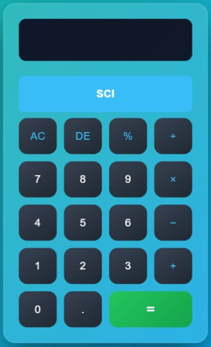
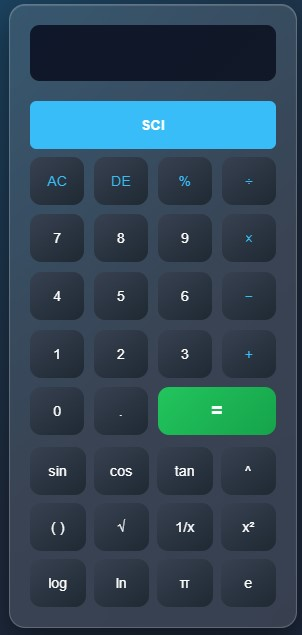
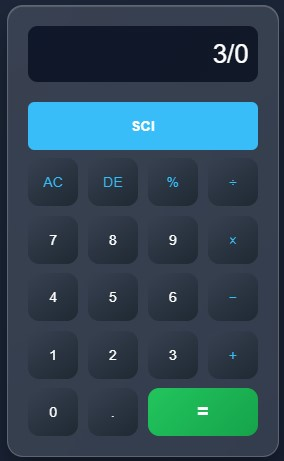
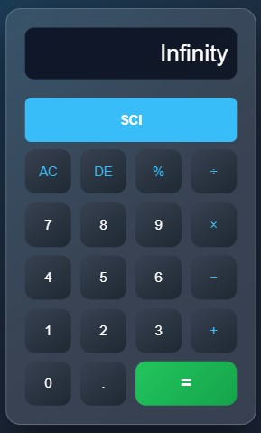
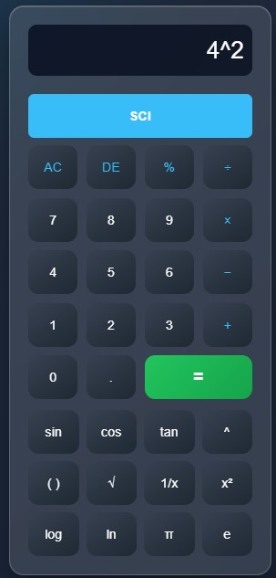
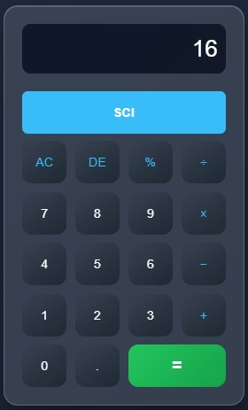

# Calculator

A scientific and responsive calculator web application that performs both basic arithmetic and advanced scientific operations. This project is built using HTML, CSS, and JavaScript with a clean and user-friendly interface.

## 📸 Screenshots
## 📸 Home Page

## 🧮 Result Page

  
  

  
  

## ✨ Features
- Basic arithmetic operations: Addition, Subtraction, Multiplication, Division  
- Scientific functions: sin, cos, tan, log, square root, power, etc.  
- Responsive design for desktop and mobile devices  
- Real-time calculation and error handling  
- Simple and intuitive UI  

## 🛠️ Technologies Used
- HTML5  
- CSS3  
- JavaScript (ES6)

## 📂 Project Structure
Calculator/
│── Calculator.html
│── style.css
│── script.js
│── README.md

